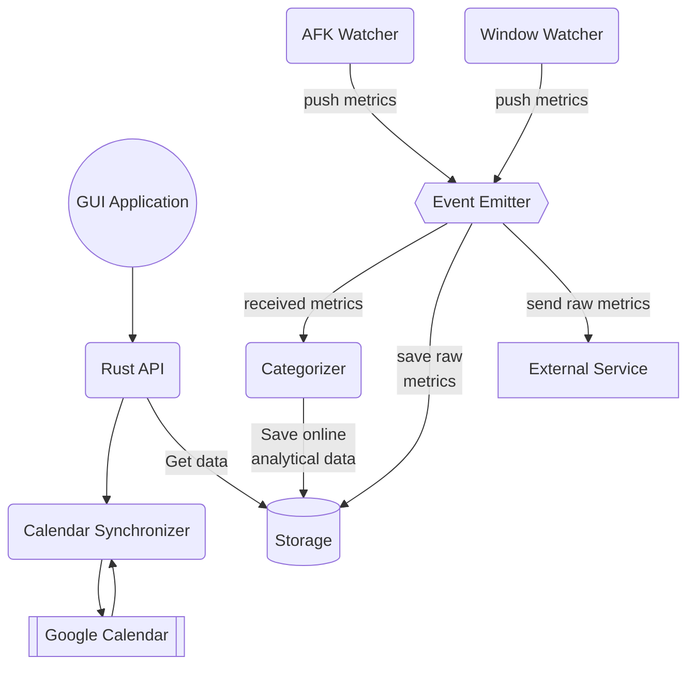

## Architecture overview

## What need to learn ?

Before jump into this project, programmers should have a basic understanding of the following topics:

- [Rust](https://doc.rust-lang.org/book/): A low-level compiled programming language designed for performance, reliability, and productivity. It's blazingly fast and memory-efficient, but unlike C++, it guarantees memory safety (i.e, no memory leaks).
- [Tauri](https://tauri.app): Cross-platform desktop app framework
- Multithreading programming

### Learning Rust

Reference: <https://doc.rust-lang.org/book/>

1. Programming concepts: Variables, functions, flow control, data types, expressions, ...
2. Ownership & Borrowing:
   1. Explain about stack and heap in memory allocation. 
   2. Explain the concept of ownership in Rust. How does it differ from C++'s memory management?
   3. What are the rules for ownership and borrowing in Rust?
   4. How does Rust prevent common memory-related bugs like null pointers or dangling pointers?
3. Traits and Lifetimes:
   1. How do traits in Rust compare to C++'s interfaces or abstract classes?
   2. Explain lifetimes in Rust and how they're used to prevent certain types of bugs.
   3. What are the differences between lifetimes and ownership?
4. Error Handling
    1. Compare and contrast Rust's `Result` and `Option` types with error handling mechanisms in try-catch block.
    2. How does Rust's Result type allow for concise and safe error handling?
5. Unsafe Rust:
   1. When and why would you use unsafe blocks or functions in Rust?
   2. What precautions should be taken when using unsafe code in Rust?
6. Memory Management and Smart Pointers:
   1. Describe the different smart pointers available in Rust and their purposes.
   2. Explain the role of `Rc` and `Arc` in Rust.
7. Concurrency control
   1. Using threads to run code concurrently
   2. Transfer data between threads by message passing
   3. Shared state concurrency (mutex, atomic, semaphore, ...)
8. Advanced topics:
   1. Automated Testing
   2. Traits, Generics, and Macros
   3. Closures 
   4. ...

### Learning Tauri

See the document at <https://tauri.app/v1/guides/>.