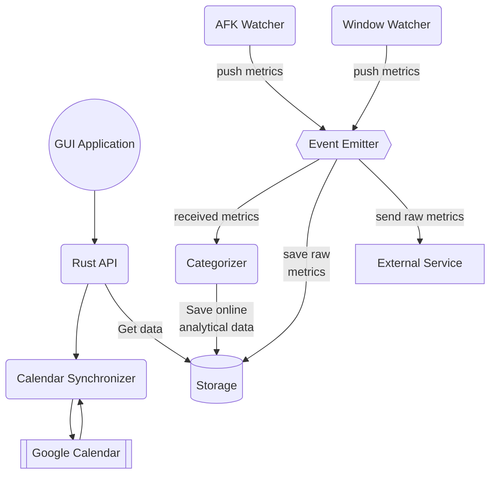

## Architecture overview

```mermaid
graph TB
  API(Rust API)
  UI((GUI Application))
  AFKWatcher(AFK Watcher)
  WindowWatcher(Window Watcher)
  Categorizer(Categorizer)
  CalendarSynchronizer(Calendar Synchronizer)
  GGCalendar[[Google Calendar]]
  EventEmitter{{Event Emitter}}
  DB[(Storage)]
  3RD[External Service]

  AFKWatcher --push metrics--> EventEmitter
  WindowWatcher --push metrics--> EventEmitter

  EventEmitter --received metrics--> Categorizer
  EventEmitter --save raw\n metrics--> DB
  EventEmitter --send raw metrics--> 3RD

  CalendarSynchronizer --> GGCalendar
  GGCalendar --> CalendarSynchronizer

  API --> CalendarSynchronizer

  UI --> API
  Categorizer --"Save online\n analytical data"--> DB
  API --Get data--> DB
```
