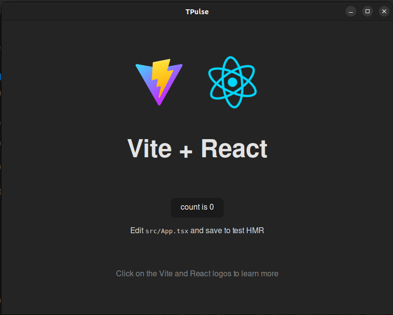

# How to run `tpulse`
1. Setting up system dependencies: https://tauri.app/v1/guides/getting-started/prerequisites, example:  
- On Linux (for Debian distribution):  

    ```sh
    sudo apt update
    sudo apt install libwebkit2gtk-4.0-dev \
        build-essential \
        curl \
        wget \
        file \
        libssl-dev \
        libgtk-3-dev \
        libayatana-appindicator3-dev \
        librsvg2-dev
    ```

2. Install project dependencies and start app:

    ```sh
    yarn && yarn tauri dev
    ```

3. If you encounter error like this on VSCode:

    ```sh
    symbol lookup error: /snap/core20/current/lib/x86_64-linux-gnu/libpthread.so.0: undefined symbol: __libc_pthread_init, version GLIBC_PRIVATE
    ```
    try to run command:

    ```sh
    unset GTK_PATH
    ```
4. This is result:  
    
