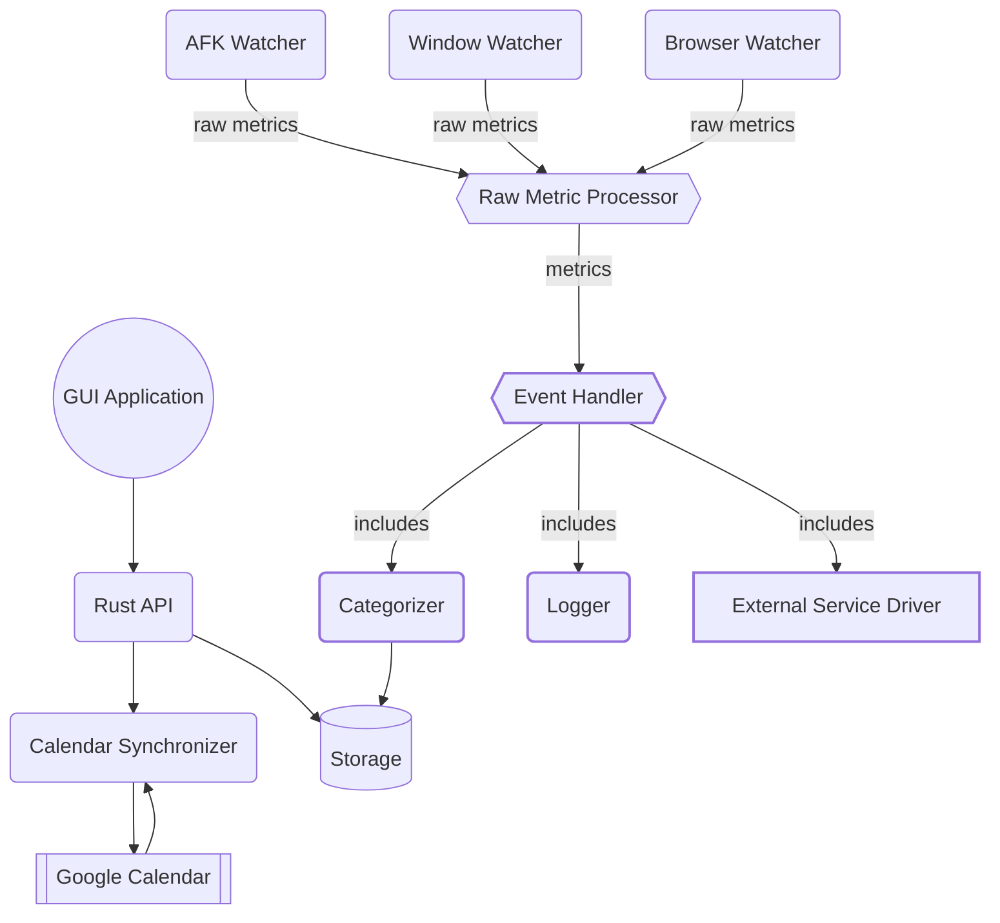

## Architecture overview

```mermaid
graph TB
  API(Rust API)
  UI((GUI Application))
  AFKWatcher(AFK Watcher)
  WindowWatcher(Window Watcher)
  BrowserWatcher(Browser Watcher)
  CalendarSynchronizer(Calendar Synchronizer)
  GGCalendar[[Google Calendar]]
  DB[(Storage)]
  RawMetricProcessor{{Raw Metric Processor}}
  Categorizer(Categorizer)
  Logger(Logger)
  3RD[External Service Driver]
  EventHandler{{Event Handler}}

  AFKWatcher --raw metrics--> RawMetricProcessor
  WindowWatcher --raw metrics--> RawMetricProcessor
  BrowserWatcher --raw metrics--> RawMetricProcessor

  RawMetricProcessor --metrics--> EventHandler

  EventHandler --includes--> Categorizer 
  EventHandler --includes--> Logger
  EventHandler --includes--> 3RD

  CalendarSynchronizer --> GGCalendar
  GGCalendar --> CalendarSynchronizer

  API --> CalendarSynchronizer

  UI --> API
  Categorizer --> DB
  API --> DB

  classDef inheritance stroke-width:2px;
  class ArrowHead inheritance;
  class EventHandler,Categorizer,Logger,3RD inheritance;
```
