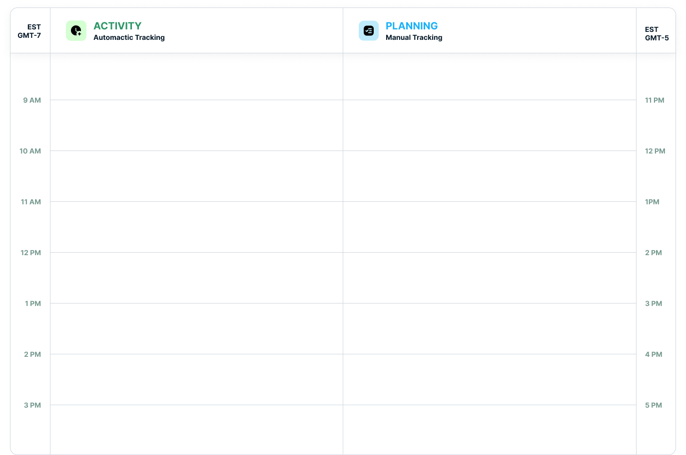
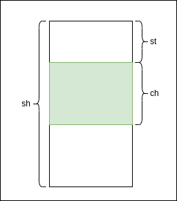

# Timetable

The timetable has many items on it. Each item has a start time, end time, and other its own data. We need to query items that are happening at a certain time.



Timetable must be able to:

- Scroll
- Zoom in/out


Current timerange displayed on the screen changes when a user scrolls or zooms in/out. We need to query items that are happening between it.

## Implementation



Given the height of current component `ch`, total scroll height `sh`, and scroll top position `st`. Current timerange is represented by [`t1`, `t2`]. When a user scrolls, `st` will change.

When a user zooms in/out, the unit of time display on y-axis changes. For example, if the user zooms in, the unit of time changes from 1 hour to 1 minutes. We can call the zoom level `z`. When `z` is 1, the unit of time is 1 hour. When `z` is 2, the unit of time is 30 minutes.

Now we need to calculate the new timerange [`t1`, `t2`] when a user scrolls or zooms in/out.

Current time unit of the y-axis `tu`:

```python
tu = 3600 / z
```

Start time t1:

```python
t1 = (86400 /cu) * st
```

End time t2:

```python
t2 = (86400 / cu) * (st + ch)
```
